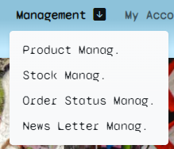
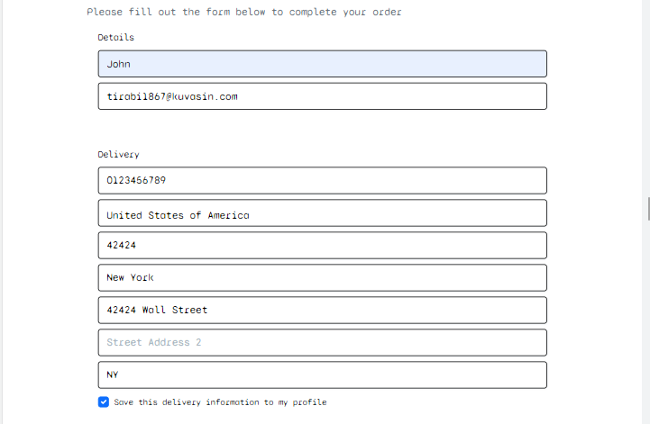

# Street Craft - Store

Street Craft is an online store selling skateboards and other products using graffiti street art as design. A B2C business with a vision to reach their target audience (people interested in skateboarding and street style) through the internet. With the mission to deliver quality products through a reliable, fast and intuitive online sales platform. 

- Here is the link to the final project > [Street Craft - Store](https://streetcraft.herokuapp.com/)

<div align="center">
    
</div>

## Contents

## UX/UI Design

During the elaboration of the project, the aspects for the final result to respect a good UX (User experience) and UI (User interface) behavior were taken into consideration, thus delivering a quality project where the user can follow the steps of a purchase without difficulties or complications.

### Strategy

#### Site owner goals

As mentioned, the project is an e-commerce project. I chose as the main product to be commercialized in the online store the skateboard with the theme of using real street art (graffiti) as design. To complement the product options were also added hats and bags. The business model is B2C where our target audience are direct consumers.

The idea for marketing and promotion would be the presence in social networks targeting the topics of skateboarding, graffiti, hip hop / rap community and other street sports. With a well designed SEO for the website and that transmits confidence and transparency to users, I believe it would be a project with potential for success.

  - The Street Craft e-commerce store aims to be responsive on multiple devices to reach and be available to as many people as possible.
  - Be practical to register and access the account/profile for users who wish to do so.
  - So that users can easily add products to their bag and also modify it with convenience.
  - That users can view offers and discounted prices.
  - That the online store has a practical and simple checkout, requesting only the most important information to finish the order safely.
  - That the website provides feedback on important user actions, such as messages informing when logged in, logged out, when the order was completed, or at other relevant times.
  - That users can review their information when necessary, like delivery details, order details or status.

#### Agile

For the development of this project, the Agile methodology was applied. As a support tool, I used the GitHub projects.

- To visualize the project access this link > [Agile Street Craft](https://github.com/users/guisgrande/projects/2)

As you can see, we used a simple Kanban board with the fields (To do, Doing, Done). To do the next ones that will be executed, Doing the ones that are currently being developed and Done the ones that were finished.

The final structure after the elaboration was 6 different epics and a total of 32 User Stories distributed among them. In the following image, I detail the EPICs and their respective US.

<details>
    <summary>Agile Structure</summary>
    <div align="center">
        
    </div>
</details> 

To run agile most efficiently, the following Sprints were determined as per the following image. The User Stories __#18 Filter products__  was not implemented in the project at this moment, being on stand by for future updates.

<details>
    <summary>Agile Sprints</summary>
    <div align="center">
        
    </div>
</details>

#### User stories

- As an user, I want to know what kind of products I will find in the store, so I can decide if it is the product of my interest.
- As an user, I want to see which products are on sale, so I can add them to my bag if the price attracts me.
- As an user, I want to easily add or remove products from my bag, so I can adapt my product selection according to my needs.
- As an user, I want to easily proceed to the checkout when I finalize my choice, so I can complete the purchase without complications.
- As an user, I want to see that my order has been successfully completed, so I can be sure that the payment proceeded correctly.
- As an user, I want to register or connect with the company, so I can be informed with the news and promotions.
- As a site owner, I want to easily add, edit or remove products, so I can provide new products or correct some information.
- As a site owner, I want to send a communication to the subscribers of the site, so I can send promotions and communications.
- As a site owner, I I want to update stock and order status, so I can keep accurate information.

### Scope

For the scope of this project the following key points were determined.
- Create a webpage application using the Django framework.
- Create a checkout using Stripe as payment method tool.
- Use bootstrap to make the site responsive, and custom CSS and Java Script to complement.
- The website should be functional and intuitive, easy to navigate and proceed to checkout.
- Allow the user to create an account to keep the information saved.
- Allow users to manipulate their delivery details informations.
- Allow the user to add and manipulate the products in the bag before checkout.
- Allow the site owner add, update or remove produtos direct from the website.
- Allow the site owner to update stock and order status direct from the website.

### Structure

The page structure for Street Craft Store was determined as follows:
- Home, profile, products (filter pages for: Categories / Offers), shopbag, checkout (checkout page / checkout success), management (Product Manag. / Stock Manag. / Order Status Manag. / New Letter Manag.).

For __users not logged in__, will be displayed:
- Home, products (filter pages for: Categories / Offers), sign in, sign up, shopbag, checkout (checkout page / checkout success).

For __users logged in__, will be displayed:
- Home, products, My account (My profile / Logout), shopbag, checkout (checkout page / checkout success).
- My profile will contain My orders, Change password, Coupon info, Delete profile and Update delivery information.

For __superuser (site owner) logged in__, will be displayed:
- Home, products (filter pages for: Categories / Offers), management (Product Manag. / Stock Manag. / Order Status Manag. / New Letter Manag.), My account (My profile / Logout), shopbag, checkout (checkout page / checkout success).
- My profile will be the same as users.

### Skeleton

#### Wireframes

The wireframe was created using the Figma tool. During the elaboration of the wireframes, I added what the front end should look like. At the end of the development some changes were made.

- To visualize full desktop wireframe project > [Figma - Street Craft Desktop](https://www.figma.com/file/cNH4NoT9CU6UJT8fp4qUqO/PP5?node-id=4%3A187&t=37SdRfbrboNm8mZH-0)

<details>
    <summary>Wireframes - Desktop</summary>
    <div align="center">
      IMAGES HERE
    </div>
</details>

- To visualize full mobile wireframe project > [Figma - Street Craft Mobile](https://www.figma.com/file/cNH4NoT9CU6UJT8fp4qUqO/PP5?node-id=0%3A1&t=37SdRfbrboNm8mZH-0)

<details>
    <summary>Wireframes - Mobile</summary>
    <div align="center">
      IMAGES HERE
    </div>
</details>

#### Database diagram

The database for Street Craft was designed to determine all the models present in the project and their relationships.

Regarding the purchase and checkout process, the user may or may not be logged in. It is possible to finish the purchase without an account. The selected products are added to the shopbag and when accessing the checkout, the information is automatically transferred.

Regarding the coupon only logged in users have access to it.

<details>
    <summary>Diagram</summary>
    <div align="center">
        
    </div>
</details>

### Surface

#### Colour scheme

For the Street Craft project I used predominantly standard Bootstrap colors.

The custom colors I determined to use were as follows. These are applied to the navigation bar and footer. 

For the texts, the colors white or black were applied according to the background color to have the proper contrast.

<details>
    <summary>Colour scheme</summary>
    <div align="center">
        IMAGE HERE
    </div>
</details>

#### Typography

The site's font was chosen from google fonts. I chose the Syne Mono (REgular 400) font. It was used throughout the entire site, including titles and body.

#### Imagery

To increase the visual response of the e-commerce I selected some images related to the products/theme of the project. The images for the website were acquired from Unsplash and the ones used for the products were from Canva.

On the home page I used three cartoon images as the hero section.

Another image was used as background for the accounts pages/templates.

Bootstrap icons were used to give more emphasis to the titles.

## Features

### Existing Features

#### __Favicon__

- Favicon is loaded on every page, the little logo is also present in the navbar.

<div align="center">
  
</div>

#### __Navbar__

- Navbar that is present on all pages for user navigation through the online store. 
- Is present for everyone the logo/banner that redirects to the home page, the search bar, a link to Home, a link to Shop(Dropdown) - All Products / Select Category(Skateboards / Caps & Hats / Backpacks & Bags) / Special Offers(New Arrivals / Special Sale / Las Chance), a shopbag where display Bag icon, total of products and value.

- The other links are displayed depending on whether the user is logged off or not, and what type of account.

- For not logged users, the links are displayed: : Sign in and Sign up.

<div align="center">
  
  
</div>
<div align="center">
  
</div>

- For logged users, the links are displayed: : My Account(Dropdown) - My Profile / Logout

<div align="center">
  
  
</div>

- For logged superusers, the links are displayed: : My Account(Dropdown) - My Profile / Logout and Management(Dropdown) - Product Manag. / Stock Manag. / Order Status Manag. / News Letter Manag.

<div align="center">
  
  
</div>

- Navbar is responsive, for mobiles it automatically groups to drowdown menu.

<div align="center">
  
</div>
<div align="center">
  
</div>

#### __Footer__

- The footer is shown only when reaching the end of the page, it counts with a few navegation links, News Letter - Subscribe button and Social links.

<div align="center">
  
</div>

- For not logged users, the links are displayed: : Home / All Products / Sign in / Sign up.

<div align="center">
  
</div>

- For logged users and superusers, the links are displayed: : Home / All Products / My Profile / Logout.

<div align="center">
  
</div>

- The News Letter - Subscribe button, open a modal form when clicked. Where the user can subscribe using e-mail and a name.

<div align="center">
  
</div>
<div align="center">
  
</div>

- The Social links are four in total, they open a new page of the corresponding social network when clicked.

<div align="center">
  
</div>

#### __Home Page - Hero__

At the beginning of the home page, the first section has a carousel of images, three in total. Each one counts with a call text and a button that redirects to a different page of the site.

- First slide: The button redirects to the products page
- Second slide: The button redirects to registration page
- Third slide: The button redirects to skateboards page only.

<div align="center">
  
  
  
</div>

#### __Home Page - New Arrivals__

- The New Arrivals section has custom text to call the user into action and the SHOP button when clicked redirects the user to a page with the products in that specific offer. On the initial page, only the last four products of this promotion are displayed, and it is possible for the user to add the product to the shopbag already from that moment on.

<div align="center">
  
</div>

#### __Home Page - Special Offers__

- The Special Offers section has custom text to call the user into action and the SHOP button when clicked redirects the user to a page with the products in that specific offer. On the initial page, only the last four products of this promotion are displayed, and it is possible for the user to add the product to the shopbag already from that moment on.

<div align="center">
  
</div>

#### __Home Page - Last Chance__

- The Last Chance section has custom text to call the user into action and the SHOP button when clicked redirects the user to a page with the products in that specific offer. On the initial page, only the last four products of this promotion are displayed, and it is possible for the user to add the product to the shopbag already from that moment on.

<div align="center">
  
</div>

#### __Home Page - News Letter__

- This section has text to attract the user's attention to register to the News Letter, and has required fields for e-mail and name, and a subscribe button.
- Upon registration the user receives an e-mail confirming registration and a message is also reflected on the website.

<div align="center">
  
</div>

#### __Home Page - Social__

- This section also has a text to attract the user to follow Street Craft pages on social networks
- The Social buttons are four in total, they open a new page of the corresponding social network when clicked

<div align="center">
  
</div>

#### __Home Page - Sign up Coupon__

- The last section of the home page is visible only to users logged in. It contains a text explaining and inviting the user to create an account for a 10% discount coupon.
- The button redirects the user to the registration page.

<div align="center">
  
</div>

#### __Sign up__

- Registration page, with a simple form with the field for username, e-mail twice and for password twice, a button to register. A short text that calls who already has a registration to the login page.

<div align="center">
  
</div>

#### __Sign in__

- Access page, with two fields to be filled in (username/e-mail and password) or login using Google account. 
- A button to log in and another to forgot password. A remember me check is also present.
- A short text with a callout for those who don't have an account.

<div align="center">
  
  
</div>

#### __Sign out__

- Page for logged in users who have selected the logout option, it asks if they really want to perform this action.

<div align="center">
  
  
</div>

#### __Forgot Password__

- Page for the user to recover the password, there is a text with the necessary action, a field for the e-mail and a button to reset the password. 
- By clicking the button an e-mail is sent with a new link to change the password.

<div align="center">
IMAGE HERE
</div>

#### __My Profile__

- Returns the username from which account you are logged in.
- It shows some account options like: a button for My Orders, a field to show active coupons, a button to change the password and another button to delete the profile.
- The delivery data is available as a form that can be changed. By clicking the update info button the information entered into the fields is saved and a success message is displayed

<div align="center">
  
  
</div>

#### __My Orders__

- Returns the total orders of the logged in user.
- A list with the following information: Order Number / Date / Items / Order Total 
- The Order Number ia a link to redirect to that order details page.

<div align="center">
  
</div>

#### __Order Details__

- It shows the details of the order. It is possible to see the order number, date, products and quantity, billing info, delivering info, contact info and order status.
- The Order Status returns what step the order is currently at, and the next and completed steps
- It also has two buttons, one to go back to My Profile page and the other to My Orders.

<div align="center">
  
</div>

#### __Change Password__

- Hhave three fields to fill in on the form. The first is the current password and the other two are for the new password. I only need the second to secure and confirm the new password. 
- It also has two buttons, one Change Password and Back to My Profile.

<div align="center">
  
</div>

#### __Delete Profile__

- Area for the user to confirm that he really wants to delete the account. Rephrase the question informing that all data will be deleted when confirming. 
- If the user has any active orders in the system, a warning is loaded on the page so that he can write down the necessary information. And a button to redirect to My Orders.
- A button to cancel (redirect to My Profiel) and a link back to shop.

<div align="center">
  
</div>

#### __All Products__

- The main page for displaying the store's products. 
- At the top, it shows how many products there are for a given search / filter. A selection box is present to sort among all products, sorted by price or name.
- It has 8 products per page.
- The user can add the product to the shopbag via the product card container and select the quantity.
- By clicking on the product image, the user is redirected to the product detail page.
- By selecting the category or offer in the navigation bar the user will only see the products in that specific filter.

<div align="center">
  
  
  
  
  
</div>

#### __Product Details__

- It shows a picture of the product and just below the average reviews. If the user is logged in, a button is displayed that redirects to the reviews page.
- It is possible to see all information, name, SKU, offer if any, price (discounted price if any), description.
- Quantity field (Less / More buttons).
- Buttons for KEEP SHOPPING (back to products page) and ADD TO BAG.
- If logged as superuser the buttons to edit and delete product are visible at the end.
- Delete product button, redirect to a new page to confirm action.

<div align="center">
  
  
</div>

#### __Shopbag__

- If the shopbag is empty, only a text is displayed and the button to KEEP SHOPPING
- It shows a list with the added products.
- A product image with the name, sku and unit price.
- A field to modify the quantity with the button to update. And the button to remove the product.
- The order and delivery totals are displayed.
- If the user is logged in, a field to add the discount coupon is displayed and the button to apply it. If it is valid the discount is applied and the discount field is displayed.
- At the end are the buttons for KEEP SHOPPING (back to products page) and SECURE CHECKOUT (redirect to checkout page).

<div align="center">
  
  
  
</div>

#### __Checkout__

- It shows a Order Summary with a resume of the order.
- A form with contact and delivery information to be filled in. If the user is logged in and has the information saved, these fields are automatically filled in.
- If user not logged display option links to create an account ou to login. If user are logged in, display a check bos to auto save the form information to profile.
- Field for credit card data, using the Stripe tool.
- At the end are the buttons for Adjust Bag (back to shopbag page) and Complete Order (submit the form if valid, and redirect to success checkout page).

<div align="center">
  
  
  
</div>

#### __Checkout Success__

- As soon as the order is processed and payment has been confirmed successful, an e-mail is sent to the user with the order information and the order number.
- It shows the details of the order. It is possible to see the order number, date, products and quantity, billing info, delivering info, contact info.
- At the end have one button Check out the latest promotions (redirect to products page)

<div align="center">
  
</div>
<div align="center">
  
</div>

#### __Managemente - Add Product__

- Accessible only to superuser. 
- It has a form for the site owner to easily add new products to the store.
- One button for cancel(redirect to My Prodile page) and one button for add product (If valid, submit form and add new product).
- When added a success message appears

<div align="center">
  
</div>

#### __Managemente - Stock__

- Accessible only to superuser. 
- Shows a list of all products on the site. A column with the information name/ku, current stock and update stock.
- Each product has a line, where site owner can enter the quantity to be updated and confirm with the check `✓` button.
- When updated a success message appears

<div align="center">
  
</div>

#### __Managemente - Order Status__

- Accessible only to superuser. 
- Shows a list of all orders on the site. A column with the information order number, date, current status and update status.
- Each order has a line, where site owner can select the status to be updated and confirm with the check `✓` button.
- When updated a success message appears

<div align="center">
  
</div>

#### __Managemente - News Letter__

- Accessible only to superuser. 
- Shows the total number of registered e-mails, a field to enter the subject and another to enter the message (body). 
- The button to send the e-mail to everyone.
- When sent a success message appears

<div align="center">
  
</div>

#### __Marketing - Custom Facebook Page__

- A customized page for the store was created on Facebook. In order to increase the presence of the store on social networks. 

<div align="center">
  
</div>

### Features Left to Implement

- For the future implement the User Stories __#18 Filter products__ that has not been completed at this time. To allow users to better filter the results.
- Create a section where the user can customize his skateboard.
- Allow users to comment along with their reviews.
- Add another model for coupons that can be used by anyone, to be used in a promotional campaign.

## Testing

All the tests performed in the project are documented in the file TESTING.md > [Access here](TESTING.md)

### Fixed Bugs

|   Bugs    | Solutions  |  Commits |
|    ---    |     ---    |    ---   |
|  TypeError, wrong variable name.  |   Edit variable name to the correct one.   |   [Commit](https://github.com/guisgrande/fifth-project-ci/commit/497226d2843bbf28a6396895fb1ff056a1d72460)   |
|  Template not loading media  |   Insert `'django.template.context_processors.media'` to TEMPLATES 'context_processors'   |   [Commit](https://github.com/guisgrande/fifth-project-ci/commit/67e367958c6bbb09ca5512292110165bc17ab8d2)   |
|  Allauth templates not loading custom style  |   Moved templates to correct folder  |   [Commit](https://github.com/guisgrande/fifth-project-ci/commit/54b7095c99d5daa00847a760a7b51334981cfb3a)   |
|  Error when send sending confirmation e-mail  |   Moved templates to correct folder  |   [Commit](https://github.com/guisgrande/fifth-project-ci/commit/a892602390a1b42bc8910ca881c082c64cf86c9b)   |
|  Not showing when coupon was used  |   Edit if condition to correct verify if have any coupon applied   |   [Commit](https://github.com/guisgrande/fifth-project-ci/commit/316c1c74973b7ec4a4bf550c0cd2e9aef5ee5a46)   |
|  Checkout error when user not logged  |   Add if condition to verify if user is authenticated and set to None if not.   |   [Commit](https://github.com/guisgrande/fifth-project-ci/commit/63c1acf6e8cdc3da21331d4e9958bd734e523ccc)   |
|  Error sending News Letter mails  |   Remove extra brackets from email_list inside send_mail method   |   [Commit](https://github.com/guisgrande/fifth-project-ci/commit/93199db53f493d2c54a75ffc5113f75f32671654)   |

### Unfixed Bugs 

- So far all bugs found have been fixed. After the tests, The only point to be reviewed is the connection with the Google account that sometimes it returns error 400: redirec_uri_mismatch.

## Deployment

- To create this project I used GitHub and GitPod.
- I used the [Code Institute Gitpod Full Template](https://github.com/Code-Institute-Org/gitpod-full-template), clicking on the "Use this template" button. From there I created the repository on Github with my username.
- These commands were used for version control during project:
    * git status - to check the status of the files to be commited.
    * git add filename - to add files before committing.
    * git commit -m "message" - to commit changes to the local repository.
    * git push - to push all committed changes to the GitHub repository.

### Deployment

1. Create Django project and app

    - I installed django using the command `pip3 install Django==3.2`;
    - I installed supporting libraries / models to this project presents in requirements.txt file:
    ```
    asgiref==3.5.2
    boto3==1.26.11
    botocore==1.29.11
    dj-database-url==0.5.0
    Django==3.2
    django-allauth==0.41.0
    django-countries==7.2.1
    django-crispy-forms==1.14.0
    django-storages==1.13.1
    gunicorn==20.1.0
    jmespath==1.0.1
    oauthlib==3.2.1
    Pillow==9.2.0
    psycopg2==2.9.5
    python3-openid==3.2.0
    pytz==2022.2.1
    requests-oauthlib==1.3.1
    s3transfer==0.6.0
    sqlparse==0.4.2
    stripe==4.2.0
    ```
    - I created the requirements.txt file using the command `pip3 freeze --local > requirements.txt`;
    - I created my Django project with the command `django-admin startproject project_name .`;
    - I created my Django app with the command `python3 manage.py startapp app_name`;
    - I used the comands `python3 manage.py makemigrations` and `python3 manage.py migrate`;
    - To test and run the project I used `python3 manage.py runserver`.

2. Create Heroku app

    - I opened the heroku website and logged into my account
    - I created a new app with the project name, chose the region Europe
    - I opened the Settings section and then Config VARS, after I initially added the keys needed to start development `SECRET_KEY`/`STRIPE_PUBLIC_KEY`/`STRIPE_SECRET_KEY`/`STRIPE_WH_SECRET`/`EMAIL_HOST_USER`/`EMAIL_HOST_PASS`/`AWS_SECRET_ACCESS_KEY`/`AWS_ACCESS_KEY_ID`/`USE_AWS`/`DATABASE_URL`;
    - Still in Config VARS I added the following keys: `PORT` with a value of `8000` and `DISABLE_COLLECTSTATIC` with a value of `1`;

3. Set up Django settings.py and necessary folders/files

    - Set up to connect the environment variables
    ```
    from pathlib import Path
    import os
    import dj_database_url
    if os.path.isfile('env.py'):
        import env
    ```
    
    - Inside `INSTALLED_APPS` I added the necessary apps
    
    - For the database I replaced it with the following code
    ```
    if 'DATABASE_URL' in os.environ:
        DATABASES = {
            'default': dj_database_url.parse(os.environ.get('DATABASE_URL'))
        }
    else:
        DATABASES = {
            'default': {
                'ENGINE': 'django.db.backends.sqlite3',
                'NAME': os.path.join(BASE_DIR, 'db.sqlite3'),
            }
        }
    ```
    
    - For the static files and media I replaced it with the following code to conect to Amazon (AWS)
    ```
    STATIC_URL = '/static/'
    STATICFILES_DIRS = (os.path.join(BASE_DIR, 'static'),)

    MEDIA_URL = '/media/'
    MEDIA_ROOT = os.path.join(BASE_DIR, 'media')

    if 'USE_AWS' in os.environ:
        # Cache Control
        AWS_S3_OBJECT_PARAMETERS = {
            'Expires': 'Thu, 31 Dec 2099 20:00:00 GMT',
            'CacheControl': 'max-age=94608000',
        }
        # Bucket Config
        AWS_STORAGE_BUCKET_NAME = 'streetcraft'
        AWS_S3_REGION_NAME = 'eu-west-1'
        AWS_ACCESS_KEY_ID = os.environ.get('AWS_ACCESS_KEY_ID')
        AWS_SECRET_ACCESS_KEY = os.environ.get('AWS_SECRET_ACCESS_KEY')
        AWS_S3_CUSTOM_DOMAIN = f'{AWS_STORAGE_BUCKET_NAME}.s3.amazonaws.com'

        # Static and media files
        STATICFILES_STORAGE = 'custom_storages.StaticStorage'
        STATICFILES_LOCATION = 'static'
        DEFAULT_FILE_STORAGE = 'custom_storages.MediaStorage'
        MEDIAFILES_LOCATION = 'media'

        # Override static and media URLs in production
        STATIC_URL = f'https://{AWS_S3_CUSTOM_DOMAIN}/{STATICFILES_LOCATION}/'
        MEDIA_URL = f'https://{AWS_S3_CUSTOM_DOMAIN}/{MEDIAFILES_LOCATION}/'
    ```
    
    - Set Google social account provider config.
    ```
    SOCIALACCOUNT_PROVIDERS = {
        'google': {
            'SCOPE': [
                'profile',
                'email',
            ],
            'AUTH_PARAMS': {
                'access_type': 'online',
            }

        }
    }
    ```
    
    - Set up Stripe config.
    ```
    # Stripe setup
    STRIPE_CURRENCY = 'usd'
    STRIPE_PUBLIC_KEY = os.getenv('STRIPE_PUBLIC_KEY', '')
    STRIPE_SECRET_KEY = os.getenv('STRIPE_SECRET_KEY', '')
    STRIPE_WH_SECRET = os.getenv('STRIPE_WH_SECRET', '')
    ```
    
    - Set up e-mail config.
    ```
    # E-mail setup
    if 'DEVELOPMENT' in os.environ:
        EMAIL_BACKEND = 'django.core.mail.backends.console.EmailBackend'
        DEFAULT_FROM_EMAIL = 'streetcraft@example.com'
    else:
        EMAIL_BACKEND = 'django.core.mail.backends.smtp.EmailBackend'
        EMAIL_USE_TLS = True
        EMAIL_PORT = 587
        EMAIL_HOST = 'smtp.gmail.com'
        EMAIL_HOST_USER = os.environ.get('EMAIL_HOST_USER')
        EMAIL_HOST_PASSWORD = os.environ.get('EMAIL_HOST_PASS')
        DEFAULT_FROM_EMAIL = os.environ.get('EMAIL_HOST_USER')
    ```
    
    - Create a Procfile and add the following text
    ```
    web: gunicorn streetcraft.wsgi:application
    ```
    
4. Final deployment.

    - In `settings.py` inside the Django project I changed DEBUG to:
    ```
    if 'USE_AWS' in os.environ:
      DEBUG = False
    else:
      DEBUG = True
    ```
    - I migrate database to ElephantSQL instance using DATABASE_URL settings, coping and pasting the URL without commit. Changing the DATABASES to:
    ```
     DATABASES = {
     'default': dj_database_url.parse('elephantsql-database-url-here')
    }
    ```
    - In Heroku I went back to Settings > Config VARS and removed the `DISABLE_COLLECTSTATIC` var;
    - In Heroku I navigated to the Deploy section;
    - I clicked to connect to GitHub and searched for my repository for this project;
    - I clicked on manual deploy to build the App;
    - When finished, I clicked the View button, which redirected me to the live site.

### Fork

- Forks let you make changes to a project without affecting the original repository. Follow this steps:
1. Go to the repository page, can be accessed [here](https://github.com/guisgrande/fifth-project-ci).
2. On top right, you select the Fork option and proceed.
3. A duplicate will be created inside your repository.

### Clone

- Clone let you create an identical repository to the original. Follow this steps:
1. Go to the repository page, can be accessed [here](https://github.com/guisgrande/fifth-project-ci).
2. Click on code drop down menu.
3. Choose if you want to clone using HTTPS, SSH or GitHub CLI. Then select de copy button.
4. Open your Git Bash in your IDE.
5. Type git clone and then paste the URL you copied before.
6. Press Enter to create your clone.

## Technologies and tools

- Programming languages used: Python 3.8, Java Script, HTML5 and CSS3.

- [Gitpod](https://www.gitpod.io/) - Used to create/edit the code of the project.
- [Github](https://github.com/) - Used to create repository, for version control and Agile project.
- [Heroku](https://heroku.com/) -  Used to deploy the project.

- Programming languages used: Python 3.8, Java Script, HTML5 and CSS3.

- [Gitpod](https://www.gitpod.io/) - Used to create/edit the code of the project.
- [Github](https://github.com/) - Used to create repository, for version control and Agile project.
- [Heroku](https://heroku.com/) -  Used to deploy the project.

- [Django](https://www.djangoproject.com/) -  Used in the development of this project. Main python Framework.
    - The following python modules were used on this project:
    ```
    asgiref==3.5.2
    boto3==1.26.11
    botocore==1.29.11
    dj-database-url==0.5.0
    Django==3.2
    django-allauth==0.41.0
    django-countries==7.2.1
    django-crispy-forms==1.14.0
    django-storages==1.13.1
    gunicorn==20.1.0
    jmespath==1.0.1
    oauthlib==3.2.1
    Pillow==9.2.0
    psycopg2==2.9.5
    python3-openid==3.2.0
    pytz==2022.2.1
    requests-oauthlib==1.3.1
    s3transfer==0.6.0
    sqlparse==0.4.2
    stripe==4.2.0
    ```

- [Bootstrap](https://getbootstrap.com/) - Used to . CSS/JS Framework for developing responsiveness and styling.
- [ElephantSQL](https://www.elephantsql.com/) - Used as database for this project.
- [Amazon AWS](https://aws.amazon.com/) - Used to upload images and cloud hosting service.
- [Jquery Ajax](https://api.jquery.com/jquery.ajax/) - Used to load more content at garage and events pages.

- [Ludichart](https://www.lucidchart.com/) - Used to create the database diagram and agile images.
- [Figma](https://figma.com/) - Used to creat the wireframes.
- [Google Fonts](https://fonts.google.com/) - Used for font selection.
- [Font Awesome](https://fontawesome.com/) - Used for the spin icon, load payment.
- [Bootstrap Icons](https://icons.getbootstrap.com/) - Used for all others icons.
- [Favicon.io](https://favicon.io/) - Used to implement the favicon on the website.
- [TinyPNG](https://tinypng.com/) - Used for reduce images size.
- [XML-sitemaps](https://www.xml-sitemaps.com/) - Used to genarate sitemap.xml file.

- [DevTools - Chrome](https://developer.chrome.com/docs/devtools/) - to assist in the development of the project.
- Lighthouse (Chrome Devtools) - Used to performance test.
- [WAVE](https://wave.webaim.org/) - Used to acecessibility test.

- [PEP8CI](https://pep8ci.herokuapp.com/) - Used to test/validate Python code.
- [JShint](https://jshint.com/) - Used to test Java Script code.
- [Jigsaw](https://jigsaw.w3.org/css-validator/) - Used to test CSS code.
- [Validator](https://validator.w3.org/) - Used to test HTML code.

## Credits

Here are the information sources I used to finish the project and develop the necessary applications for it to work well.
- [Code Institute](https://codeinstitute.net/ie/).
    - First of all thank you for the instructions provided in the Code Institue course and classes, which were essential from start to finish.
- [Django Documentation](https://docs.djangoproject.com/en/4.1/).
    - That helped me to solve doubts about Django and the framework's features.
- [Bootstrap Documentation](https://getbootstrap.com/docs/5.2/getting-started/introduction/).
    - Served as a guide to better apply the functionalities of this great framework.

Some tutorials and codes I used in my project.
- [Caktusgroup - Filtering and pagination django](https://www.caktusgroup.com/blog/2018/10/18/filtering-and-pagination-django/).
    - Used some code into `products/templatetags/product_tag.py` for pagination work when using any filter.

- [PyLessons - Subscribe to Newsletter in Django](https://pylessons.com/django-subscribe).
- [Dev.to - How to build a Email Newsletter Subscriber in Django](https://dev.to/shubhamkshatriya25/how-to-build-a-email-newsletter-subscriber-in-django-j2p).
    - Used some code and instucton to build my News Letter model.

### Code

### Content

- [Canva](https://canva.com/).
    - All images used to create the demo content/products for the site were all selected from the Canva site. The images used in the skateboard, bags and caps mockups.

### Media

- The three photos used for Hero (Home page) and for accounts background was taken from [Unsplash](https://unsplash.com/).
- The image used for README.md responsive mockup was taken from [Techsini](https://techsini.com/multi-mockup/index.php).
- The Street Craft logo and favicon, all products mockups (Skaboard custom made by me), image used at erro pages and custom product image placeholder were taken/made from [Canva](https://www.canva.com/)

## Acknowledgements

- Code Institute for all the support and the team always ready to help.
- My mentor [Ben Kavanagh](https://github.com/BAK2K3) for all the instructions, advice and knowledge that helped me to improve the project.
- My parents, my wife and my friends for motivating me to achieve my best.
- Everyone in the Slack community for tips and opinions. 
